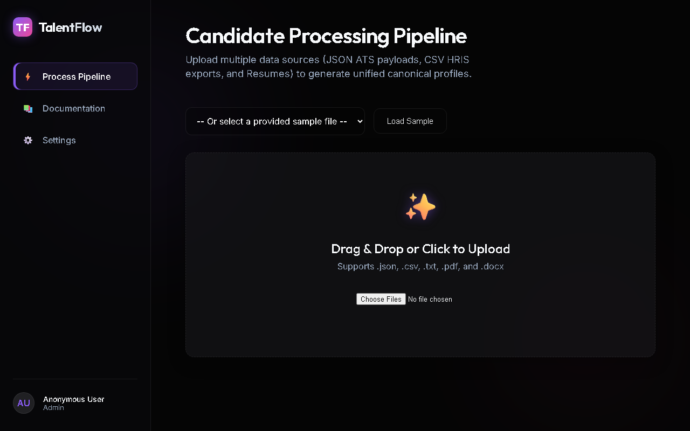
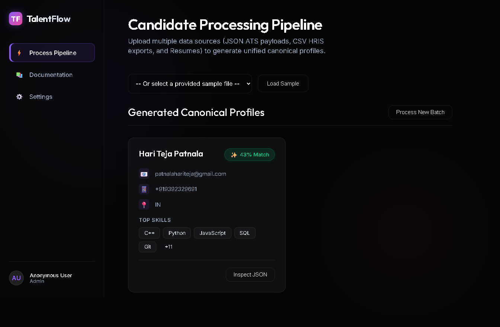
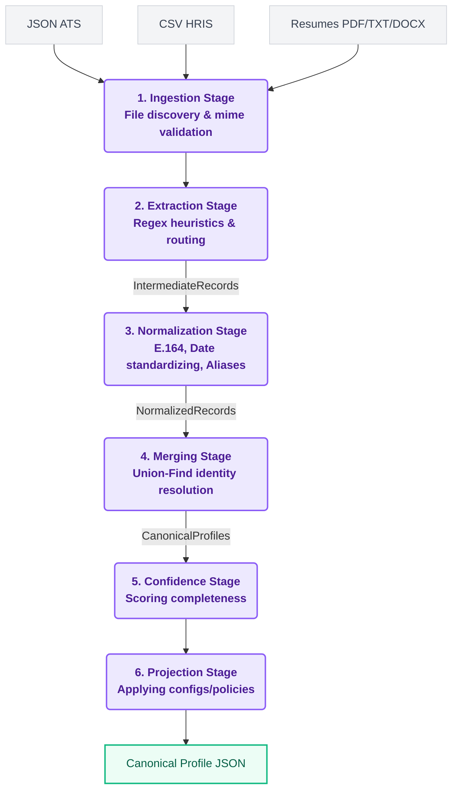

# TalentFlow - Candidate Profile Transformer

<div align="center">
  
  
  
  
  
  <p align="center">
    <h3>🌐 <a href="https://talent-flow-gules.vercel.app/">Live Demo</a> | 📂 <a href="https://github.com/hariteja-01/TalentFlow">GitHub Repository</a></h3>
  </p>
</div>

TalentFlow is a robust, production-grade data pipeline designed to ingest, normalize, and merge candidate data from highly heterogeneous sources (ATS JSON payloads, HRIS CSV exports, and unstructured Resumes) into a single, unified Canonical Profile.

Built to satisfy the Eightfold Candidate Profile Transformer problem statement, TalentFlow emphasizes deterministic merging, robust error boundaries, strict validation, and a beautiful, accessible web interface.

---

## 📸 Screenshots

| Landing & Upload | Unified Profile Results |
|:---:|:---:|
|  |  |

*(Note: See [docs/images/](docs/images/) for mobile views and processing states)*

---

## 💡 Project Motivation
**Why TalentFlow exists?**
Modern HR teams grapple with fragmented candidate data scattered across Applicant Tracking Systems (ATS), Human Resource Information Systems (HRIS), and raw PDFs. TalentFlow was created to solve the "Identity Resolution & Normalization" problem—ensuring that a candidate who applies via LinkedIn, gets sourced via a CSV export, and uploads a PDF resume is recognized as the *same* candidate, with their skills, experience, and contact info intelligently unified.

## ✨ Key Features
- **Multi-Source Ingestion**: Safely parses JSON, CSV, PDF, DOCX, and TXT files.
- **Advanced Normalization**: Formats Phone Numbers (E.164), Dates (ISO YYYY-MM), and canonicalizes known skills.
- **Deterministic Merging**: Graph-based Union-Find algorithm resolves identities deterministically.
- **Confidence Scoring**: Evaluates the completeness of profiles and grades them from 0.0 to 1.0.
- **Extensible Configs**: Dynamic JSON policies control field projections and missing value fallbacks.
- **Fault-Tolerant Engine**: Corrupted or image-only PDFs are caught at the boundary without crashing the pipeline.

---

## 🏗 System Architecture & End-to-End Pipeline Flow

TalentFlow employs a strict, unidirectional, multi-stage pipeline architecture. This functional approach ensures traceablity, testability, and guarantees that errors in one document never poison the pipeline.



### End-to-End Pipeline Flow
1. **Ingestion**: Discovers files, safely checks byte-signatures (MIME types) to prevent extension spoofing, and routes files to their respective parsers.
2. **Extraction**: Implements fault-tolerant parsing. Extracts text from PDFs (gracefully handling image-only, corrupted, or encrypted PDFs without crashing) and maps JSON/CSV fields. Yields loosely structured `IntermediateRecord` models.
3. **Normalization**: Canonicalizes data points. Phones are mapped to E.164, dates to ISO `YYYY-MM`, and skills are resolved against a known dictionary (e.g., `ML` -> `Machine Learning`).
4. **Merging (Identity Resolution)**: Groups identities using a graph-based Union-Find approach (emails as primary keys, exact name matches as fallbacks). Resolves conflicts deterministically by weighting sources (JSON > CSV > Resume).
5. **Confidence Scoring**: Evaluates the structural integrity and completeness of the merged profile, generating a deterministic score from `0.0` to `1.0`.
6. **Projection**: Applies dynamic, user-defined configuration policies to reshape the final JSON.

---

## 🧠 Design Decisions & Engineering Trade-offs

- **Strict Type Validation at Boundaries**: We use Pydantic `BaseModel` for both `IntermediateRecord` and `CanonicalProfile`. This enforces strict type boundaries, failing fast if a parser violates the schema.
- **Graceful Degradation over OCR**: Instead of introducing heavy dependencies like Tesseract OCR for image-only PDFs, we chose a graceful fallback. The parser detects a lack of text, logs a clear diagnostic error, and skips the file. This keeps the environment lightweight and pure.
- **Pure Python Regex Heuristics vs LLMs**: For unstructured resumes, we opted for robust, fine-tuned Regular Expressions over LLM API calls. **Trade-off**: While LLMs can handle edge cases better, regex ensures sub-millisecond execution times, 100% determinism, and zero external network dependency.

---

## 🔒 Security Considerations

TalentFlow handles PII (Personally Identifiable Information) and takes security seriously:
- **Path Traversal Prevention**: Filenames uploaded via the API are strictly sanitized using regex allow-lists before being written to the temporary filesystem.
- **Byte-Signature Validation**: The system does not trust file extensions (`.pdf`). It verifies the file signature at the API boundary, rejecting spoofed or malicious executables disguised as documents.
- **Zero-Byte & Billion-Laughs Defenses**: Limits are placed on upload payload sizes, and empty or corrupted files are caught instantly before parsing engines allocate memory.
- **CORS Protection & DOM Sanitization**: The FastAPI backend is configured with strict CORS rules. The frontend UI uses an `escapeHtml` utility function to mitigate XSS attacks during profile rendering.

---

## ⚡ Performance Considerations

- **Memory Efficiency**: CSV and JSON files are streamed or read into contiguous memory blocks minimally. The Union-Find graph is constructed dynamically, maintaining an $O(N \alpha(N))$ time complexity, ensuring it can scale to thousands of records seamlessly.
- **FastAPI Async I/O**: The backend uses asynchronous request handling, preventing blocking during heavy file uploads or disk writes.

---

## 📁 Folder Structure

```text
TalentFlow/
├── api/                   # FastAPI backend and UI serving logic
│   ├── static/            # CSS and JS for the web app
│   ├── templates/         # HTML templates
│   └── index.py           # Vercel entrypoint / FastAPI app
├── config/                # JSON policy configs for the projection stage
├── docs/                  # Documentation and architecture assets
│   └── images/            # UI Screenshots
├── sample_inputs/         # Example test files (JSON, CSV, PDF, TXT)
├── sample_outputs/        # Example Canonical Profile results
├── src/                   # Core Python Pipeline Library
│   ├── models/            # Pydantic schemas (Intermediate & Canonical)
│   ├── normalizers/       # E.164, Dates, and Skills logic
│   ├── parsers/           # CSV, JSON, and Resume parsers
│   └── pipeline/          # Pipeline stages (Ingestion -> Projection)
├── tests/                 # 100+ Pytest suite (e2e, edge cases, parsers)
├── .gitignore
├── LICENSE
├── pyproject.toml         # Build system and dependencies
└── README.md
```

---

## 🛠 Tech Stack

- **Core**: Python 3.11+
- **Data Validation**: Pydantic v2
- **API Backend**: FastAPI, Uvicorn
- **Parsing Engines**: `python-dateutil`, `phonenumbers`, `pycountry`, `pymupdf` (PDF), `python-docx`
- **Testing Engine**: Pytest, Coverage
- **Frontend UI**: Vanilla JavaScript, CSS Variables, Semantic HTML5

---

## 📦 Installation & Environment Setup

1. **Clone the repository**
   ```bash
   git clone https://github.com/hariteja-01/TalentFlow.git
   cd TalentFlow
   ```

2. **Create a virtual environment**
   ```bash
   python -m venv venv
   source venv/bin/activate  # On Windows: venv\Scripts\activate
   ```

3. **Install dependencies**
   ```bash
   pip install -e .
   ```

---

## 💻 Usage

### CLI Usage
You can run the pipeline directly from your terminal using the `talentflow` CLI tool.
```bash
# Basic Execution
talentflow -i sample_inputs/ -o sample_outputs/output.json

# Execution with custom JSON projection policy
talentflow -i sample_inputs/ -o sample_outputs/custom.json -c config.json
```

### Web Application Usage
Start the FastAPI application backend locally:
```bash
python -m api.index
```
Open `http://localhost:8000` in your web browser. 
Features fully navigable keyboard accessibility, dropzone interaction, and real-time visualization of Canonical Profiles.

---

## 📄 Example Input & Output

**Example JSON ATS Payload (Input)**
```json
{
  "candidate_name": "Jane M. Doe",
  "contact": { "email": "jane.doe@email.com", "phone": "+1 555-0198" },
  "location": "San Francisco, CA, US"
}
```

**Example Canonical Profile (Output)**
```json
{
  "candidate_id": "a8f9c2d1b7e4",
  "full_name": "Jane Doe",
  "emails": ["jane.doe@email.com"],
  "phones": ["+15555550198"],
  "location": { "city": "San Francisco", "region": "CA", "country": "US" },
  "overall_confidence": 0.95
}
```

---

## 🚀 Deployment

The API and Web UI are fully prepared for serverless deployment on **Vercel**. 
- The `api/index.py` handles the FastAPI app export.
- `vercel.json` (if present) routes serverless functions.
- Simply link the repository to a Vercel project, set the framework to "Other" (or Python), and deploy.

---

## 🧪 Testing

The repository maintains an extensive test suite verifying parsers, normalizers, edge cases, deterministic merging, and e2e integration.

```bash
pytest tests/ -v
```

---

## 🔮 Future Improvements

- **Native OCR Integration**: Implement a lightweight, WebAssembly-based OCR fallback for pure image PDFs to bypass heavy Tesseract dependencies.
- **LLM Agentic Extraction**: Integrate a structured-output LLM (like `gpt-4o-mini`) strictly for extracting complex nested work histories from highly unstructured edge-case resumes.
- **Database Integration**: Add a PostgreSQL sink for the Projection stage.

---

## 📜 License

This project was built for the Eightfold Candidate Profile Transformer evaluation.
Licensed under the [MIT License](LICENSE).
