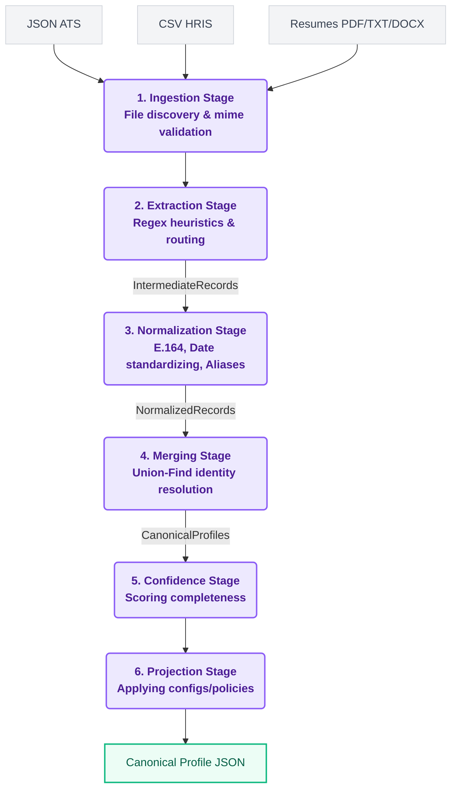

# TalentFlow - Candidate Profile Transformer

TalentFlow is a robust, production-grade data pipeline designed to ingest, normalize, and merge candidate data from highly heterogeneous sources (ATS JSON payloads, HRIS CSV exports, and unstructured Resumes) into a single, unified Canonical Profile.

Built to satisfy the Eightfold Candidate Profile Transformer problem statement, TalentFlow emphasizes deterministic merging, robust error boundaries, strict validation, and a beautiful, accessible web interface.

---

## 🏗 Architecture & Data Flow

TalentFlow employs a strict, unidirectional, multi-stage pipeline architecture. This functional approach ensures traceablity, testability, and guarantees that errors in one document never poison the pipeline.



### Stage Breakdown

1. **Ingestion**: Discovers files, safely checks byte-signatures (MIME types) to prevent extension spoofing, and routes files to their respective parsers.
2. **Extraction**: Implements fault-tolerant parsing. Extracts text from PDFs (gracefully handling image-only, corrupted, or encrypted PDFs without crashing) and maps JSON/CSV fields. Yields loosely structured `IntermediateRecord` models.
3. **Normalization**: Canonicalizes data points. Phones are mapped to E.164, dates to ISO `YYYY-MM`, and skills are resolved against a known dictionary (e.g., `ML` -> `Machine Learning`).
4. **Merging (Identity Resolution)**: The core engine. Groups identities using a graph-based Union-Find approach (emails as primary keys, exact name matches as fallbacks). Resolves conflicts deterministically by weighting sources (JSON > CSV > Resume) and union-deduplicating arrays.
5. **Confidence Scoring**: Evaluates the structural integrity and completeness of the merged profile, generating a deterministic score from `0.0` to `1.0`.
6. **Projection**: Applies dynamic, user-defined configuration policies to reshape the final JSON. Supports field omitting, path mapping (e.g., `links.linkedin` -> `social_url`), and error enforcement.

---

## 🧠 Design Decisions & Trade-offs

- **Strict Type Validation at Boundaries**: We use Pydantic `BaseModel` for both `IntermediateRecord` and `CanonicalProfile`. This enforces strict type boundaries between pipeline stages.
- **Graceful Degradation for PDFs**: Instead of bloatware dependencies like Tesseract OCR for image-only PDFs, we chose a graceful fallback. The parser detects lack of text, logs a clear diagnostic error, and skips the file. This keeps the environment lightweight and pure.
- **Deterministic Pipeline Execution**: The pipeline guarantees the same input files always produce the identical Canonical Profiles. We achieved this by sorting input paths, implementing stable Union-Find algorithms, and breaking merge ties using stable attributes like `source_name`.
- **Pure Python Regex Heuristics vs LLMs**: For unstructured resumes, we opted for robust, fine-tuned Regular Expressions over LLM calls to ensure sub-millisecond execution times, 100% determinism, and zero external network dependency.

---

## 🔒 Security & Privacy

TalentFlow handles PII (Personally Identifiable Information) and takes security seriously:

- **Path Traversal Prevention**: Filenames uploaded via the API are strictly sanitized using regex allow-lists before being written to the temporary filesystem.
- **Byte-Signature Validation**: The system does not trust file extensions (`.pdf`). It verifies the file signature at the API boundary, rejecting spoofed or malicious executables disguised as documents.
- **Zero-Byte & Billion-Laughs Defenses**: Limits are placed on upload payload sizes, and empty or corrupted files are caught instantly before parsing engines allocate memory.
- **CORS Protection & DOM Sanitization**: The FastAPI backend is configured with strict CORS rules. The frontend UI uses an `escapeHtml` utility function to mitigate XSS attacks during profile rendering.

---

## 🚀 Features & Capabilities

- **CLI Interface**: A native command line tool (`talentflow`) built with Click for processing directories in CI/CD pipelines.
- **Dynamic Configuration Policy**: Supply a `config.json` to alter how canonical profiles are emitted (ideal for syncing to downstream ATS systems with differing schemas).
- **Provenance Tracking**: Every value in the Canonical Profile ships with a `provenance` trace. You always know *which file* provided a data point and *how* it was merged.
- **Glassmorphic Web Interface**: A sleek, accessible web dashboard featuring drag-and-drop uploads, interactive JSON inspection, ARIA-labels, keyboard navigation, and responsive design.

---

## 🛠 Tech Stack

- **Core**: Python 3.11+
- **Data Validation**: Pydantic v2
- **API Backend**: FastAPI, Uvicorn
- **Parsing Engines**: `python-dateutil`, `phonenumbers`, `pycountry`, `pymupdf` (PDF), `python-docx`
- **Testing Engine**: Pytest, Coverage
- **Frontend UI**: Vanilla JavaScript, CSS Variables, Semantic HTML5

---

## 📦 Installation & Setup

1. **Clone the repository**
   ```bash
   git clone https://github.com/hariteja-01/TalentFlow.git
   cd TalentFlow
   ```

2. **Create a virtual environment**
   ```bash
   python -m venv venv
   source venv/bin/activate  # On Windows: venv\Scripts\activate
   ```

3. **Install dependencies**
   ```bash
   pip install -e .
   ```

---

## 💻 Usage

### Command Line Interface (CLI)

```bash
# Basic Execution
talentflow -i sample_inputs/ -o sample_outputs/output.json

# Execution with custom JSON projection policy
talentflow -i sample_inputs/ -o sample_outputs/custom.json -c config.json
```

### Web Application

Start the FastAPI application backend:
```bash
python -m api.index
```
Open `http://localhost:8000` in your web browser. 
Features fully navigable keyboard accessibility, dropzone interaction, and real-time visualization of Canonical Profiles.

---

## 🧪 Testing

The repository maintains an extensive test suite verifying parsers, normalizers, edge cases, deterministic merging, and e2e integration.

```bash
pytest tests/ -v
```

---

## 📄 License

This project was built for the Eightfold Candidate Profile Transformer evaluation.
