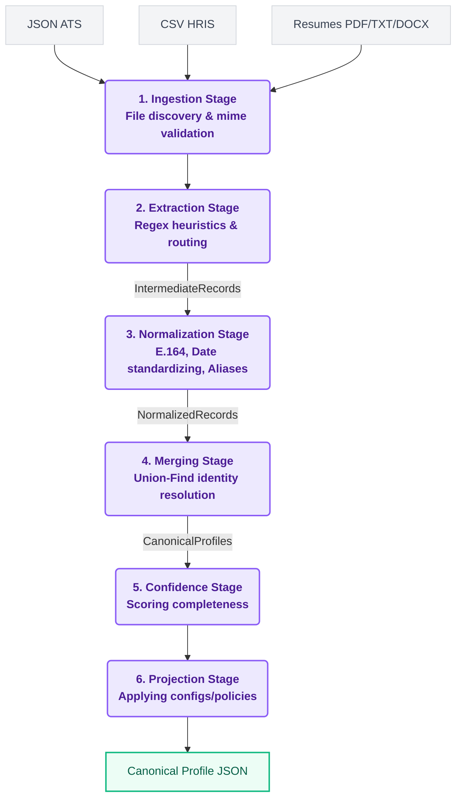

# TalentFlow - Candidate Profile Transformer

<div align="center">
  
  
  
  
</div>

## 🎥 Demo Video

[](https://www.youtube.com/watch?v=dQw4w9WgXcQ)

*A 2-minute walkthrough demonstrating the pipeline, custom configs, and key design decisions.*

## 🔗 Quick Links
- 🌐 [Live Demo](https://talent-flow-gules.vercel.app/)
- 📂 [GitHub Repository](https://github.com/hariteja-01/TalentFlow)
- 📄 [Stage 1 Design Document (PDF)](docs/HariTeja_patnalahariteja_Eightfold.pdf)

## 🏗 System Architecture & End-to-End Pipeline Flow

TalentFlow employs a strict, unidirectional, multi-stage pipeline architecture. This functional approach ensures traceability, testability, and guarantees that errors in one document never poison the pipeline.



## ✨ Key Features

- **Multi-Source Ingestion**: Unifies ATS JSON, HRIS CSVs, PDF/DOCX Resumes, and GitHub API data.
- **Identity Resolution**: Resolves candidate duplicates deterministically using Union-Find via exact email matching.
- **Dynamic Projection Layer**: Supports reshaping output fields and omitting missing data via custom JSON configurations.
- **Robust Error Handling**: Never crashes on malformed files, gracefully skips and warns.
- **Beautiful Web Interface**: Modern, responsive interface to easily visualize transformed data.

## 📸 Screenshots

| Landing & Upload | Unified Profile Results |
|:---:|:---:|
|  |  |

## 📥 Sample Inputs & Outputs

TalentFlow processes unstructured and structured data sources into clean, canonical profiles. 

<details>
<summary><b>1. Sample Inputs (The Messy Data)</b></summary>
<br>

**Unstructured Resume (PDF/TXT)**
```text
Jane Doe
San Francisco, CA
janedoe@personal.com | jane.doe@email.com
(415) 555-2671
linkedin.com/in/janedoe

SUMMARY
Experienced ML engineer with 7+ years building production machine learning systems...
```

**Structured ATS Data (JSON)**
```json
{
  "applicant_name": "Jane M. Doe",
  "contact_email": ["jane.doe@email.com", "jane@techcorp.com"],
  "contact_phone": ["+1 (415) 555-2671"],
  "address": { "city": "San Francisco", "state": "CA", "country": "US" }
}
```

**Structured HRIS Data (CSV)**
```csv
full_name,email,phone,location,headline,skills
Jane Doe,jane.doe@email.com,415-555-2671,"San Francisco, California, United States",Machine Learning Engineer,"Python, ML, TF, Docker"
```
</details>

<details>
<summary><b>2. Sample Output - Default Canonical Schema</b></summary>
<br>

All of the above sources for Jane Doe are automatically merged into a single, unified canonical profile.
Notice how the name is resolved to the highest-weight source ("Jane M. Doe" from the ATS), phones are normalized to E.164 (`+14155552671`), skills are canonicalized ("TF" -> "TensorFlow"), and confidence/provenance is calculated.

```json
{
  "candidate_id": "06d24a918a15",
  "full_name": "Jane M. Doe",
  "emails": [
    "jane.doe@email.com",
    "jane@techcorp.com",
    "janedoe@personal.com"
  ],
  "phones": [
    "+14155552671"
  ],
  "location": {
    "city": "San Francisco",
    "region": "California",
    "country": "US"
  },
  "headline": "Senior Machine Learning Engineer",
  "years_experience": 7.0,
  "skills": [
    {
      "name": "Python",
      "confidence": 1.0,
      "sources": ["candidate_ats.json", "candidates.csv", "resume_jane_doe.txt"]
    }
  ],
  "overall_confidence": 0.85
}
```
*(Note: Excerpted for brevity. The full profile contains exhaustive arrays of skills, experience, education, and provenance tracing for every single field).*
</details>

<details>
<summary><b>3. Sample Output - Recruiter View (Custom Config)</b></summary>
<br>

Using runtime configs, you can project the canonical profile into whatever schema downstream consumers need. Here is a projection mapped for a hypothetical Recruiter Dashboard using `configs/recruiter_view.json`:

```json
{
  "id": "06d24a918a15",
  "name": "Jane M. Doe",
  "primary_email": "jane.doe@email.com",
  "top_skills": [
    "Python",
    "Machine Learning",
    "TensorFlow"
  ],
  "current_title": "Senior Machine Learning Engineer",
  "is_highly_confident": true
}
```
</details>

## 🚀 Quick Start

### Prerequisites
- Python 3.11 or higher
- `pip` package manager

### Installation
```bash
# Clone the repository
git clone https://github.com/hariteja-01/TalentFlow.git
cd TalentFlow

# Create virtual environment
python -m venv venv
source venv/bin/activate  # Windows: venv\Scripts\activate

# Install dependencies
pip install -e .
```

### CLI Usage - Default Schema
```bash
# Process sample inputs with default output schema
python -m src.cli --input sample_inputs/ --output sample_outputs/default_output.json

# View the output
cat sample_outputs/default_output.json
```

### CLI Usage - Custom Configs
```bash
# Minimal profile (name, email, skills only)
python -m src.cli --input sample_inputs/ --output sample_outputs/minimal_profile.json --config configs/minimal_profile.json

# Recruiter view (optimized for recruiter dashboard)
python -m src.cli --input sample_inputs/ --output sample_outputs/recruiter_view.json --config configs/recruiter_view.json

# No confidence scores
python -m src.cli --input sample_inputs/ --output sample_outputs/no_confidence.json --config configs/no_confidence.json
```

### Web UI
```bash
# Start local server
python -m api.index

# Open browser
# Navigate to: http://localhost:8000

# Upload files via drag-and-drop
# View unified canonical profiles
```

## 💡 Project Motivation

TalentFlow was built to satisfy the Eightfold Candidate Profile Transformer problem statement, emphasizing deterministic merging, robust error boundaries, strict validation, and a beautiful, accessible web interface.

## 🛡️ Edge Cases Handled

This system gracefully handles numerous edge cases per the "robust" requirement:

1. **Multi-Source Single Candidate**: Multiple files (CSV, JSON, PDF, GitHub URL) for the same person (matching email) → merged into ONE unified profile.
2. **Duplicate Profiles**: Same candidate across different sources → deduplicated via email-based identity resolution.
3. **Missing/Corrupted Files**: Malformed JSON, corrupted PDF, missing CSV columns → gracefully skipped, no crash.
4. **Invalid Data Formats**: Unparseable phone numbers, invalid dates, unknown countries → normalized to null (not invented).
5. **Non-Resume Documents**: Financial statements, invoices, unrelated PDFs → conservative extraction with very low confidence, empty fields rather than garbage.
6. **GitHub API Failures**: 404 user not found, 403 rate limit, network timeout → graceful degradation with partial data (cascading fallback to HTML scraping).
7. **Array Access on Empty Arrays**: Custom config requests `emails[0]` but emails is empty → returns null per `on_missing` policy.
8. **Conflicting Data Across Sources**: Different names/phones in different sources → highest-weighted source wins, documented in provenance.
9. **Empty Source Files**: Valid CSV with zero rows, empty JSON object → skipped gracefully.
10. **Education Date Parsing**: Date ranges like "August 2023 - Present" filtered out from institution names.

**Philosophy**: "Wrong-but-confident is worse than honestly-empty" - we return null rather than guess.

## 🛠 Tech Stack

- **Backend / Pipeline**: Python 3.11+, Pydantic (data models), PyMuPDF (PDF extraction), python-docx (DOCX extraction), phonenumbers (normalization).
- **Web Interface**: FastAPI, Uvicorn, Vanilla JS, HTML/CSS.
- **Testing**: Pytest, Pytest-Cov.

## 🧪 Testing

Run the test suite using pytest:
```bash
pytest tests/ -v --cov=src
```

## 📋 Assumptions

1. **Source Priority**: When sources conflict, priority is: ATS JSON (0.9) > CSV (0.7) > PDF Resume (0.65) > GitHub API (0.4).
2. **Email-Based Identity**: Primary matching key is email address; name similarity is fallback.
3. **Skill Canonicalization**: Only well-known technical skills are canonicalized; unknown skills kept as-is or filtered if suspicious.
4. **GitHub API Rate Limits**: Using unauthenticated API (60 requests/hour); for production, would use authenticated token.
5. **E.164 Phone Format**: Uses `phonenumbers` library; defaults to `None` region if country code missing.
6. **Deterministic Processing**: Files processed in sorted order to ensure same inputs → same outputs.
7. **Conservative Extraction**: When document structure unclear, return empty/null rather than guess.

## ⚠️ Deliberately Descoped

Under time constraints, the following were intentionally left out:

1. **OCR for Image-Only PDFs**: Using PyMuPDF for text extraction; pure-image PDFs return empty data (would need Tesseract OCR).
2. **LLM-Based Extraction**: Using regex heuristics for determinism; LLM extraction would be more flexible but non-deterministic.
3. **LinkedIn Profile Parsing**: Removed entirely; LinkedIn blocks scraping and requires paid API access.
4. **Real-Time API Monitoring**: No retry logic or exponential backoff for GitHub API; simple try-catch error handling.
5. **Database Persistence**: Pipeline outputs JSON files; no PostgreSQL/MongoDB integration.
6. **Authentication**: Web UI has no login/auth; suitable for demo, not production.
7. **Advanced Resume Formats**: Handles standard resume layouts; complex multi-column or table-heavy resumes may extract incorrectly.
8. **Internationalization**: Phone normalization assumes common formats; exotic international formats may fail.

## 📄 Documentation

- **[Stage 1 Design Document (PDF)](docs/HariTeja_patnalahariteja_Eightfold.pdf)** - Technical design covering pipeline architecture, merge policy, confidence scoring, and edge cases.
- **[Architecture Diagrams](docs/images/)** - Visual pipeline flow and system architecture.

## 🔒 Security Considerations

TalentFlow handles PII (Personally Identifiable Information) and takes security seriously:
- **Path Traversal Prevention**: Filenames uploaded via the API are strictly sanitized using regex allow-lists before being written to the temporary filesystem.
- **Byte-Signature Validation**: The system does not trust file extensions (`.pdf`). It verifies the file signature at the API boundary, rejecting spoofed or malicious executables disguised as documents.
- **Zero-Byte & Billion-Laughs Defenses**: Limits are placed on upload payload sizes, and empty or corrupted files are caught instantly before parsing engines allocate memory.
- **CORS Protection & DOM Sanitization**: The FastAPI backend is configured with strict CORS rules. The frontend UI uses an `escapeHtml` utility function to mitigate XSS attacks during profile rendering.

## 📁 Folder Structure

```
TalentFlow/
├── api/                  # FastAPI backend server
├── configs/              # Output projection configurations
├── docs/                 # Documentation and architecture assets
├── sample_inputs/        # Sample HRIS, ATS, and resume data
├── sample_outputs/       # Generated canonical profiles
├── src/                  # Core pipeline source code
│   ├── models/           # Pydantic schemas (canonical, intermediate)
│   ├── normalizers/      # Phone, date, location standardization
│   ├── parsers/          # Extraction engines (PDF, CSV, JSON)
│   ├── pipeline/         # Orchestrator and transformation stages
│   └── utils/            # Logging and shared helpers
└── tests/                # Pytest test suite
```

## 🔮 Future Improvements

1. **LLM Integration**: Replace regex extractors with structured LLM parsing for resumes with non-standard layouts.
2. **Database Backend**: Introduce SQLAlchemy for persisting profiles in PostgreSQL.
3. **ElasticSearch Integration**: Build a fuzzy-search layer on top of unified profiles.
4. **WebSocket Progress Updates**: Provide real-time UI feedback for bulk file uploads.
5. **Async Processing**: Use Celery/Redis for background processing of large batches.

## 📜 License

This project was built for the Eightfold Candidate Profile Transformer evaluation.
Licensed under the [MIT License](LICENSE).


