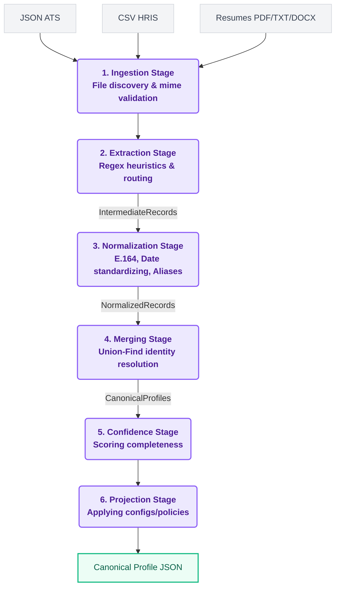

# TalentFlow - Candidate Profile Transformer

<div align="center">
  
  
  
  
  
  <p align="center">
    <h3>🌐 <a href="https://talent-flow-gules.vercel.app/">Live Demo</a> | 🎥 <a href="#">Demo Video</a> | 📂 <a href="https://github.com/hariteja-01/TalentFlow">GitHub Repository</a></h3>
  </p>
</div>

## 🎥 Demo Video

[](https://www.youtube.com/watch?v=dQw4w9WgXcQ)

*A 2-minute walkthrough demonstrating the pipeline, custom configs, and key design decisions.*

---

TalentFlow is a robust, production-grade data pipeline designed to ingest, normalize, and merge candidate data from highly heterogeneous sources (ATS JSON payloads, HRIS CSV exports, GitHub API, and unstructured Resumes) into a single, unified Canonical Profile.

Built to satisfy the Eightfold Candidate Profile Transformer problem statement, TalentFlow emphasizes deterministic merging, robust error boundaries, strict validation, and a beautiful, accessible web interface.

---

## 🚀 Quick Start

### Prerequisites
- Python 3.11 or higher
- `pip` package manager

### Installation
```bash
# Clone the repository
git clone https://github.com/hariteja-01/TalentFlow.git
cd TalentFlow

# Create virtual environment
python -m venv venv
source venv/bin/activate  # Windows: venv\Scripts\activate

# Install dependencies
pip install -e .
```

### CLI Usage - Default Schema
```bash
# Process sample inputs with default output schema
talentflow -i sample_inputs/ -o sample_outputs/default_output.json

# View the output
cat sample_outputs/default_output.json
```

### CLI Usage - Custom Configs
```bash
# Minimal profile (name, email, skills only)
talentflow -i sample_inputs/ -o sample_outputs/minimal_profile.json -c config/minimal_profile.json

# Recruiter view (optimized for recruiter dashboard)
talentflow -i sample_inputs/ -o sample_outputs/recruiter_view.json -c config/recruiter_view.json

# No confidence scores
talentflow -i sample_inputs/ -o sample_outputs/no_confidence.json -c config/no_confidence.json
```

### Web UI
```bash
# Start local server
python -m api.index

# Open browser
# Navigate to: http://localhost:8000

# Upload files via drag-and-drop
# View unified canonical profiles
```

---

## 📄 Documentation

- **[Stage 1 Design Document](docs/HariTeja_patnalahariteja_Eightfold.md)** - Technical design covering pipeline architecture, merge policy, confidence scoring, and edge cases.
- **[Architecture Diagrams](docs/images/)** - Visual pipeline flow and system architecture.

---

## 🛡️ Edge Cases Handled

This system gracefully handles numerous edge cases per the "robust" requirement:

1. **Multi-Source Single Candidate**: Multiple files (CSV, JSON, PDF, GitHub URL) for the same person (matching email) → merged into ONE unified profile.
2. **Duplicate Profiles**: Same candidate across different sources → deduplicated via email-based identity resolution.
3. **Missing/Corrupted Files**: Malformed JSON, corrupted PDF, missing CSV columns → gracefully skipped, no crash.
4. **Invalid Data Formats**: Unparseable phone numbers, invalid dates, unknown countries → normalized to null (not invented).
5. **Non-Resume Documents**: Financial statements, invoices, unrelated PDFs → conservative extraction with very low confidence, empty fields rather than garbage.
6. **GitHub API Failures**: 404 user not found, 403 rate limit, network timeout → graceful degradation with partial data (cascading fallback to HTML scraping).
7. **Array Access on Empty Arrays**: Custom config requests `emails[0]` but emails is empty → returns null per `on_missing` policy.
8. **Conflicting Data Across Sources**: Different names/phones in different sources → highest-weighted source wins, documented in provenance.
9. **Empty Source Files**: Valid CSV with zero rows, empty JSON object → skipped gracefully.
10. **Education Date Parsing**: Date ranges like "August 2023 - Present" filtered out from institution names.

**Philosophy**: "Wrong-but-confident is worse than honestly-empty" - we return null rather than guess.

---

## 📋 Assumptions

1. **Source Priority**: When sources conflict, priority is: ATS JSON (0.9) > CSV (0.7) > PDF Resume (0.65) > GitHub API (0.4).
2. **Email-Based Identity**: Primary matching key is email address; name similarity is fallback.
3. **Skill Canonicalization**: Only well-known technical skills are canonicalized; unknown skills kept as-is or filtered if suspicious.
4. **GitHub API Rate Limits**: Using unauthenticated API (60 requests/hour); for production, would use authenticated token.
5. **E.164 Phone Format**: Uses `phonenumbers` library; defaults to `None` region if country code missing.
6. **Deterministic Processing**: Files processed in sorted order to ensure same inputs → same outputs.
7. **Conservative Extraction**: When document structure unclear, return empty/null rather than guess.

---

## ⚠️ Deliberately Descoped

Under time constraints, the following were intentionally left out:

1. **OCR for Image-Only PDFs**: Using PyMuPDF for text extraction; pure-image PDFs return empty data (would need Tesseract OCR).
2. **LLM-Based Extraction**: Using regex heuristics for determinism; LLM extraction would be more flexible but non-deterministic.
3. **LinkedIn Profile Parsing**: Removed entirely; LinkedIn blocks scraping and requires paid API access.
4. **Real-Time API Monitoring**: No retry logic or exponential backoff for GitHub API; simple try-catch error handling.
5. **Database Persistence**: Pipeline outputs JSON files; no PostgreSQL/MongoDB integration.
6. **Authentication**: Web UI has no login/auth; suitable for demo, not production.
7. **Advanced Resume Formats**: Handles standard resume layouts; complex multi-column or table-heavy resumes may extract incorrectly.
8. **Internationalization**: Phone normalization assumes common formats; exotic international formats may fail.

---

## 🏗 System Architecture

TalentFlow employs a strict, unidirectional, multi-stage pipeline architecture. This functional approach ensures traceability, testability, and guarantees that errors in one document never poison the pipeline.



---

## 🔒 Security Considerations

TalentFlow handles PII (Personally Identifiable Information) and takes security seriously:
- **Path Traversal Prevention**: Filenames uploaded via the API are strictly sanitized using regex allow-lists before being written to the temporary filesystem.
- **Byte-Signature Validation**: The system does not trust file extensions (`.pdf`). It verifies the file signature at the API boundary, rejecting spoofed or malicious executables disguised as documents.
- **Zero-Byte & Billion-Laughs Defenses**: Limits are placed on upload payload sizes, and empty or corrupted files are caught instantly before parsing engines allocate memory.
- **CORS Protection & DOM Sanitization**: The FastAPI backend is configured with strict CORS rules. The frontend UI uses an `escapeHtml` utility function to mitigate XSS attacks during profile rendering.

---

## 📜 License

This project was built for the Eightfold Candidate Profile Transformer evaluation.
Licensed under the [MIT License](LICENSE).
